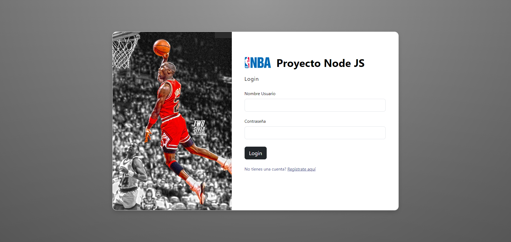
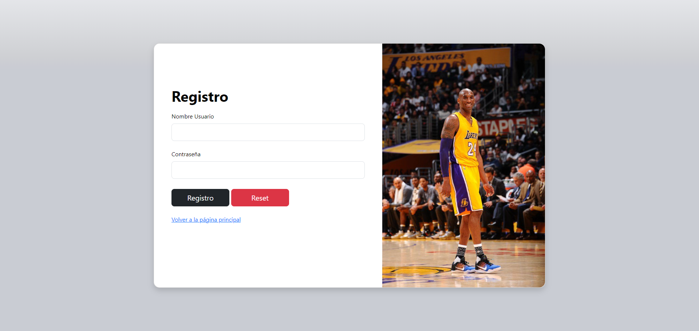
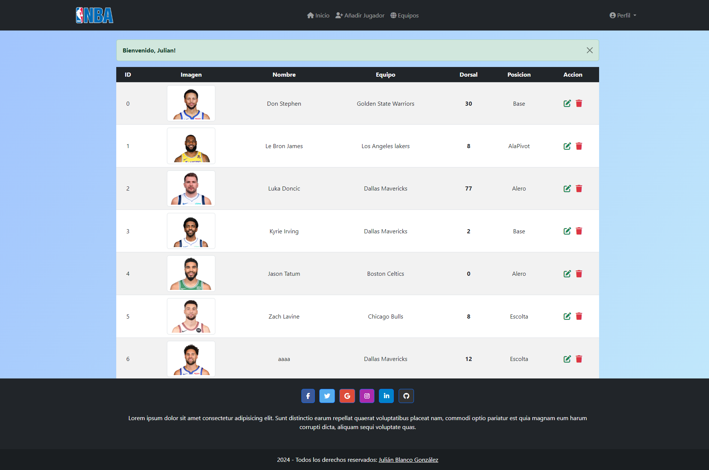
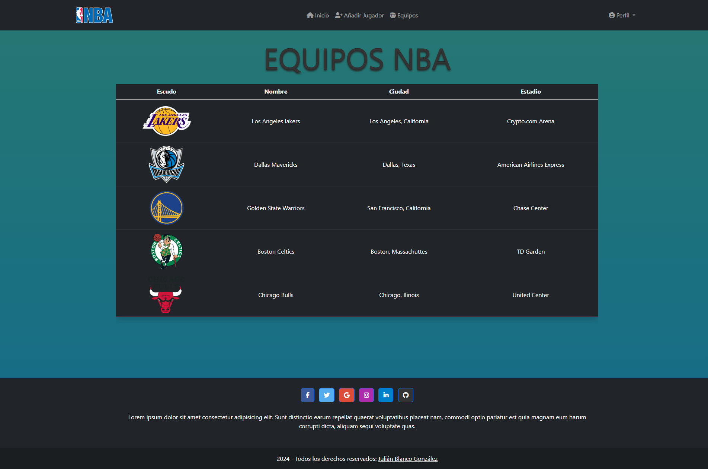
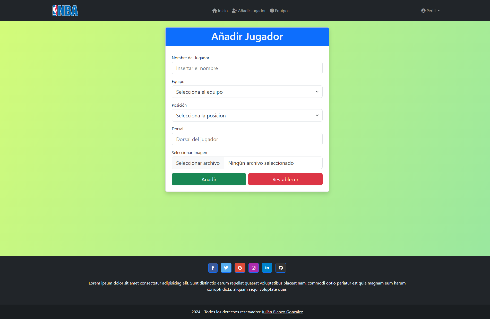
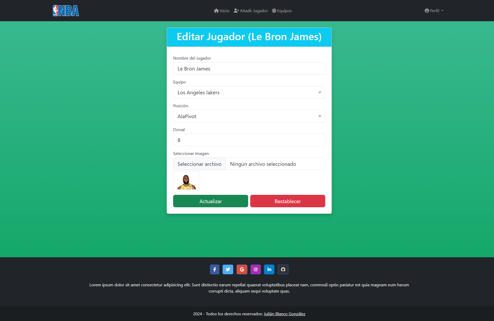
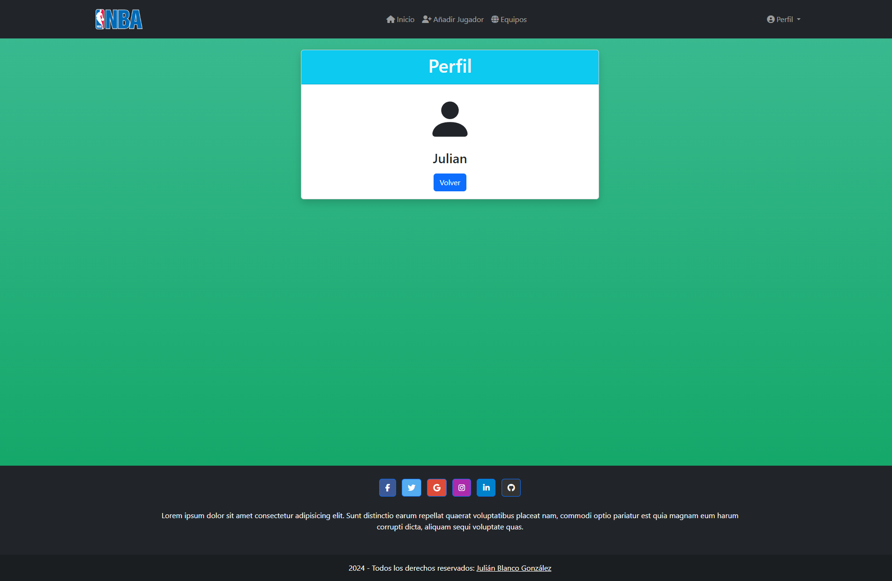

# Proyecto Node JS

Proyecto de la Asignatura de Plataformas, Frameworks y otras tendencias digitales del 4 año de Ingeniería Informática

## Descripción

El proyecto consiste en una aplicación web para aprender Node JS y las dependencias más usadas actualmente. 

## Ejecutar el proyecto

Para poder ejecutar el proyecto, hay que usar el siguiente comando en la consola:

  ```sh
  npm start
  ```

## Dependencias usadas

### Bcrypt
Encriptar las contraseñas del usuario una vez que se registre. En la base de datos de Mongo parece cifrado el campo contraseña.

### Dotenv
Almacenar en un archivo las variables de entorno del proyecto. Guardo el puerto del servidor, la url de la base de datos y la clave secreta (autenticación por Token). 

### EJS
Todas las páginas que usan o manipulan los datos de Mongo uso ejs, y para reducir mucho código, tengo un header y un footer común para todas las páginas privadas.

### Express
Para todas las redirecciones de mi página web, utilizo express, ya sea, para cargar la vista dinámica de equipos (render), o para cargar la pantalla de login, cuando el usuario se registre 
(redirect). 

### Express-Session
Enviar al cliente los datos de los jugadores, equipos, y almacenar el token de login de sesion. 

### JsonWebToken
Crear un token cada vez que se loguea el usuario y destruirlo cuando se desloguee. Gracias a esto, no se pueden acceder a las rutas privadas poniendo su url.

### Mongoose
Conexión a la base de datos de Mongo, operación CRUD y creación de los modelos de cada colección.

### Multer
A la hora de editar, subir o borrar un jugador, uno de sus campos, es una imagen. Para porder manipular la imagen, hace falta el multer, es decir, si se borra el jugador, debe borrarse la 
imagen, si se actualiza, debe borrarse la imagen anterior y guardar la nueva.

### Nodemon
Ver los cambios directamente sin tener que reiniciar el servidor.

## Capturas del proyecto

### Login (pública)


### Registro (pública)


### Inicio (privada)


### Equipos (privada)


### Añadir Jugador (privada)


### Editar Jugador (privada)


### Perfil (privada)

